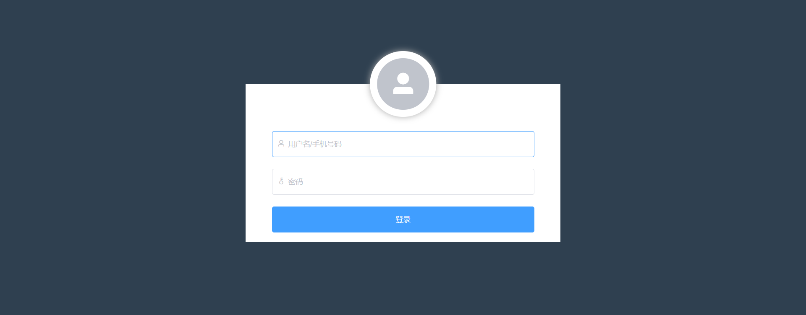
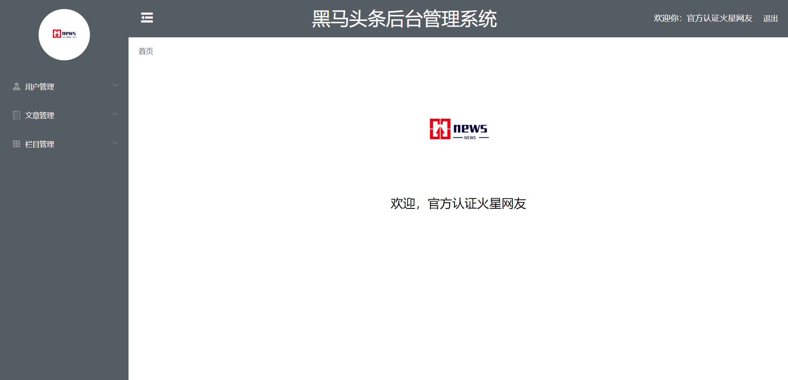
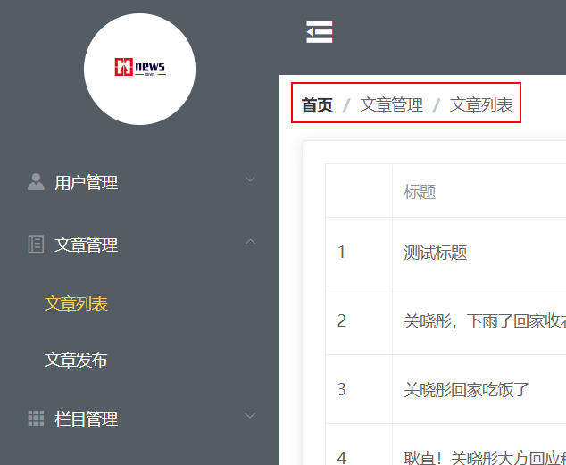
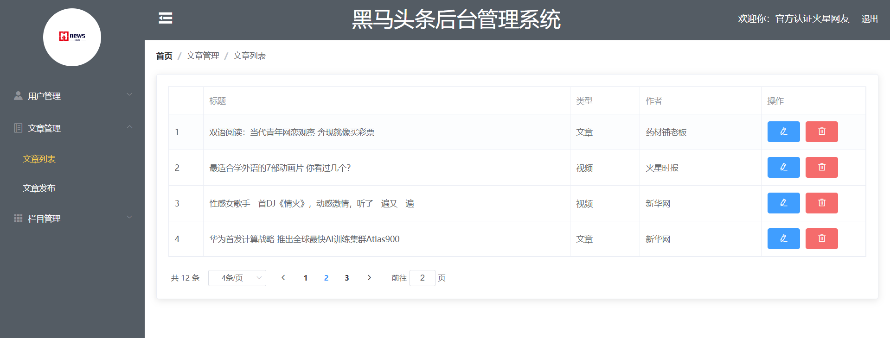
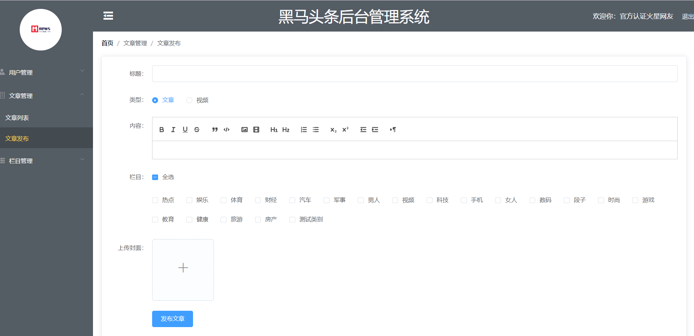

# 黑马头条后台

## <a href="#intro" id="intro">介绍</a>

对[黑马头条前台](https://gitee.com/Daazzer/heimatoutiao)项目进行管理

- 项目页面

  - 登录页面
  - 欢迎页面
  - 文章发布页
  - 文章编辑页
  - 文章表格数据页

- 项目使用技术

  - [vue](https://github.com/vuejs/vue) - web 框架
  - [vue-router](https://github.com/vuejs/vue-router)  - 页面路由
  - [element-ui](https://element.eleme.cn/#/zh-CN/) - UI 框架
  - [axios](https://github.com/axios/axios) - http 请求
  - [sass](https://github.com/sass/sass) - 预编译样式
  -  [vue-word-editor](https://github.com/hsian/vue-word-editor) - 富文本编辑

- 版本管理

  - [git](https://git-scm.com/)

- <span id="directory">项目 `src` 目录结构</span>

  ```powershell
  src
  ├─api # 项目服务器 api
  ├─assets
  │  └─fonts
  ├─components # 项目封装的组件
  ├─router # 视图路由
  ├─styles
  ├─utils # 通用性 js 文件
  └─views # 路由视图
      └─index # 首页目录
  ```

  

## <a href="#usage" id="usage">使用方法</a>

项目依赖安装

```
npm install
```

开发服务器，编译与热重载

```
npm start
```

编译打包到生产环境

```
npm run build
```


## <a href="#formatConfig" id="formatConfig">项目格式化配置</a>

自定义的 vscode 编辑器配置：`/.vscode/settings.json`

- 给函数名与函数括号之间添加一个空格

- 移除分号

```json
{
    "javascript.format.insertSpaceBeforeFunctionParenthesis": true,
    "javascript.format.semicolons": "remove"
}
```


自定义的 .editorconfig 配置文件：[`/.editorconfig` ](.editorconfig)

[editorconfig 规范](https://editorconfig.org/)

- 默认 `utf-8` 字符集
- 空格缩进类型
- 两个缩进
- 去掉行尾空格
- 空行结束

```tex
# 这个文件可以配合 vscode 的 editorconfig 插件自动格式化你指定好的文件
# http://editorconfig.org

[*]
charset = utf-8
indent_style = space
end_of_line = lf

[*.{js,jsx,ts,tsx,vue}]
indent_size = 2
trim_trailing_whitespace = true
insert_final_newline = true
```


## <a href="#server" id="server">项目数据服务器</a>

- 配置服务器基本路径：[@/utils/axios_http-config.js](src/utils/axios_http-config.js)
- 服务器 api：[@/api](src/api)

服务器基地址配置例子：

```js
import axios from 'axios'

axios.defaults.baseURL = 'http://localhost:3000'

export default axios
```

api 配置例子：

```js
import axios from '@/utils/axios_http-config'

/**
 * 文章列表
 * @param {Object} [params] 参数对象
 * @param {number} [data.category] 栏目id
 * @param {number} [data.pageIndex] 当前页码
 * @param {number} [data.pageSize] 每页显示数据条数
 * @returns {Promise<Response>}
 */
const getArticle = params => axios.get('/post', { params }).then(res => [null, res]).catch(err => [err])

/**
 * 发布文章
 * @param {Object} data 参数对象
 * @param {string} data.title 文章标题
 * @param {string} data.content 文章内容
 * @param {Array<Object>} data.categories 所属栏目ID集合
 * @param {Array<Object>} data.cover 封面图片ID集合
 * @param {number} data.type 1为文章，2为视频
 * @returns {Promise<Response>}
 */
const publishArticle = data => axios.post('/post', data).then(res => [null, res]).catch(err => [err])

const getArticleById = id => axios.get(`/post/${id}`).then(res => [null, res]).catch(err => [err])

export default {
  getArticle,
  publishArticle,
  getArticleById
}
```


为了使用 api 时不使用引入，将 api 方法挂载到 vue 根实例原型上

[@/main.js](src/main.js)

```js
import api from './api'
Vue.prototype.$api = api
```


## <a href="#router" id="router">项目路由</a>

项目路由配置：[@/router](src/router)

| URL                         | 描述                      |
| --------------------------- | ------------------------- |
| `/login`                    | [登录页](#LoginPage)      |
| `/index/welcome`            | 欢迎页                    |
| `/index/articleList`        | 文章列表页                |
| `/index/articlePublish`     | 文章发布页                |
| `/index/articlePublish/:id` | 文章编辑页                |
| `*`                         | [404 页面](#NotFoundPage) |


## <a href="#NotFoundPage" id="NotFoundPage">404 页面</a>

考虑到如果什么页面都找不到，应该返回 404 页面

### 添加 404 页的路由

```js
// ...
const routes = [
  // ...
  {
    name: 'NotFound',
    path: '*',
    component: () => import(/* webpackChunkName: "notFound" */ '@/views/NotFound.vue')
  }
]
// ...
```


404 页面视图：[@/views/NotFound.vue](src/views/NotFound.vue)


## <a href="#LoginPage" id="LoginPage">登录页的实现</a>

[@/views/Login.vue](src/views/Login.vue)

### 添加登录页的路由

有时候我们想把某个路由下的所有组件都打包在同个异步块 (chunk) 中。只需要使用 [命名 chunk](https://webpack.js.org/guides/code-splitting-require/#chunkname)，一个特殊的注释语法来提供 chunk name (需要 Webpack > 2.4)，之后的部分与此相同。[参考](https://router.vuejs.org/zh/guide/advanced/lazy-loading.html#%E6%8A%8A%E7%BB%84%E4%BB%B6%E6%8C%89%E7%BB%84%E5%88%86%E5%9D%97)

```js
const routes = [
  // ...
  {
    name: 'Login',
    path: '/login',
    component: () => import(/* webpackChunkName: "login" */ '@/views/Login.vue')
  },
  // ...
]
```


### 实现登录页的视图结构

#### 登录效果图




#### 登录页模板

技术实现：

- 使用 element-ui 的 `Container`、`Form`、`Avatar`、`FormItem`、`Input` 组件


```vue
<template>
  <el-container class="login">
    <el-form
      class="login-form"
      ref="loginForm"
      :model="user"
      :rules="rules"
    >
      <el-avatar class="login-avatar" :size="126" icon="el-icon-user-solid" />
      <el-form-item prop="username">
        <el-input
          class="login-form__username"
          placeholder="用户名/手机号码"
          prefix-icon="el-icon-user"
          v-model="user.username"
          @focus="clearValidate('username')"
        />
      </el-form-item>
      <el-form-item prop="password">
        <el-input
          class="login-form__password"
          type="password"
          placeholder="密码"
          prefix-icon="el-icon-key"
          v-model="user.password"
          @focus="clearValidate('password')"
        />
      </el-form-item>
      <el-form-item class="login-form__item--last">
        <el-button
          class="login-form__btn"
          type="primary"
          @click="login"
        >登录</el-button>
      </el-form-item>
    </el-form>
  </el-container>
</template>
```


#### 登录页样式

技术实现：

- 使用了 BEM 类名规范定义样式类名，配合  scss 的父选择器

```vue
<style lang="scss" scoped>
.login {
  position: absolute;
  top: 0;
  left: 0;
  width: 100%;
  height: 100%;
  background-color: #2f4050;
  &-form {
    position: absolute;
    display: flex;
    flex-direction: column;
    justify-content: flex-end;
    top: 22%;
    left: 50%;
    min-width: 600px;
    min-height: 302px;
    padding: 18px 50px;
    background-color: #fff;
    transform: translate(-50%);
    &__item {
      &--last {
        margin-bottom: 0;
      }
    }
    &__username,
    &__password {
      ::v-deep input {
        line-height: 50px;
        height: 50px;
      }
    }
    &__btn {
      height: 50px;
      width: 100%;
    }
  }
  &-avatar {
    $size: 126px;
    position: absolute;
    display: flex;
    justify-content: center;
    align-items: center;
    left: 50%;
    top: -$size / 2;
    transform: translate(-50%);
    border: 14px solid #fff;
    box-shadow: 0px 0px 12px 0px #ababab;
    ::v-deep i {
      font-size: 50px;
    }
  }
}
</style>
```


### 实现登录页动态数据交互

技术实现：

- 使用 `Form`  组件 `rules` 属性绑定[校验规则](https://github.com/yiminghe/async-validator)
- 使用了 `Input` 组件的 `focus` 事件重置校验规则
- 输入框不能为空的限制
- 用户名要求为 4-5 位非空字符，或者是合法的 11 为手机号码
- 点击登录按钮会进行登录
  - 如果验证不通过，则阻止登录，并在输入框底下出现提示
  - 如果本地存储有 token，则表示已经登录，阻止登录，并提示用户
  - 如果响应出错，则提示用户，并阻止登录
  - 登录成功后，存储 token 到 `localStorage` 并且跳转路由到首页

```vue
<script>
export default {
  name: 'Login',
  data () {
    return {
      user: {
        username: '',
        password: ''
      },
      // 表单验证
      rules: {
        username: [
          { required: true, message: '用户名不能为空', trigger: 'blur' },
          { pattern: /^\w{4,5}$|^1[35789]\d{9}$/, message: '请输入合法的用户名/手机号码', trigger: 'blur' }
        ],
        password: [
          { required: true, message: '密码不能为空', trigger: 'blur' },
          { min: 3, max: 16, message: '请输入3-16位密码', trigger: 'blur' }
        ]
      }
    }
  },
  methods: {
    // 清除输入框的验证提示信息
    clearValidate (prop) {
      this.$refs.loginForm.clearValidate(prop)
    },
    async login () {
      /* 
      这里的 Form 组件 API 方法如果不给回调参数，会返回一个 promise，如果不 catch 的话控制台会报错，
      无论 promise 是 fullfill 还是 reject 都会返回一个布尔值 
       */
      const isValidate = await this.$refs.loginForm.validate().then(validated => validated).catch(inValidated => inValidated)
	
      // 取本地 token
      const localToken = JSON.parse(localStorage.getItem('heimatoutiao_admin_userInfo') || '{}').token

      // 表单验证失败
      if (!isValidate) {
        return
      } else if (localToken) {
        // 防止用户重复登录
        this.$message.warning('你已登录，请不要重复登录')
        return
      }
		
      // 解构 axios 的 promise 返回值
      const [err, res] = await this.$api.login({
        username: this.user.username,
        password: this.user.password
      })

      if (err) {
        return this.$message.error('登录失败，发生错误')
      }

      const { token, user: { id } } = res.data.data
      // 将响应回来的 token 与 id 存到一个对象中然后序列化之后再存到本地 
      const userInfo = JSON.stringify({ token, id })

      localStorage.setItem('heimatoutiao_admin_userInfo', userInfo)

      this.$router.push('/')
      this.$message.success('登录成功')
    }
  }
}
</script>
```


## <a href="#routerGuard" id="routerGuard">设置路由守卫检测登录状态</a>

[@/router](src/router)

技术实现：

- vue-router 的[全局前置守卫方法](https://router.vuejs.org/zh/guide/advanced/navigation-guards.html#%E5%85%A8%E5%B1%80%E5%89%8D%E7%BD%AE%E5%AE%88%E5%8D%AB) `router.beforeEach` 实现路由拦截
- 如果用户跳到非登录页，则都要检测是否有 token，如果没有，则强制跳回登录页

```js
// ...

import { Message } from 'element-ui'

// ...

// 全局路由守卫
router.beforeEach((to, from, next) => {
  // 除了登录页，去其他页面都要验证 token
  const toRouteName = to.name
  const token = JSON.parse(localStorage.getItem('heimatoutiao_admin_userInfo') || '{}').token

  if (toRouteName !== 'Login' && !token && toRouteName !== 'NotFound') {
    Message.warning('你没有权限查看，请登录')
    next('/login')
  }
  next()
})

// ...
```


## <a href="#IndexWelcomePage" id="IndexWelcomePage">首页与欢迎页的实现</a>

### 添加首页与欢迎页路由

[@/router](src/router)

技术实现：

- 欢迎页由首页嵌套着，所以欢迎页在 `Index` 的 `children` 属性下，默认首页和欢迎页一同显示
- 由于首页的结构是一个路由嵌套结构，所以包含多个子路由，所以专门建立了一个[index 目录](#directory)表示当前视图有多个子路由视图

- 用 [URL 正则](https://github.com/pillarjs/path-to-regexp) 匹配首页的路由，匹配 `/index` 或 `/index.html` 或 `/`
- 给 `Index` 路由组件重定向到欢迎页，默认显示欢迎页

```js
// ...
const routes = [
    name: 'Index',
    path: '/(index|index.html)?',
    redirect: '/index/welcome',
    component: () => import(/* webpackChunkName: "index" */ '@/views/index'),
    children: [
      {
        name: 'Welcome',
        path: '/index/welcome',
        component: () => import(/* webpackChunkName: "index" */ '@/views/index/Welcome.vue')
      },
  // ...
```


### 实现首页视图结构

[@views/index](src/views/index)

#### 首页与欢迎页效果图



#### 首页模板

技术实现：

- 使用 `Container`、`Aside` 、`Header`、`Main` 划分页面结构
- 使用 `Image` 组件放置 logo
- 使用 `Menu`、`SubMenu`、`MenuItem` 组件进行导航
- 使用 `Breadcrumb` 组件显示导航路径


```vue
<template>
  <el-container class="index">
    <el-aside width="250px" class="index-aside">
      <div class="index-brand">
        <!-- 注意，由于 webpack 打包配置原因，这里可以使用 require 或者 import 到 data 中再挂载上来进行处理  -->
        <el-image class="logo" :src="require('@/assets/logo.png')">
          <template #error>
            <i class="el-icon-picture-outline logo__alias"></i>
          </template>
        </el-image>
      </div>
	  <!-- 为了使菜单与路由同步关联变化这里使用 vm.$route.path 填充 -->
      <el-menu
        :default-active="$route.path"
        class="index-aside__menu"
        background-color="#545c64"
        text-color="#fff"
        active-text-color="#ffd04b"
        router
        unique-opened
      >
        <el-submenu index="1">
          <template #title>
            <i class="el-icon-s-custom"></i>
            <span>用户管理</span>
          </template>
          <el-menu-item index="1-1">
            <span>用户列表</span>
          </el-menu-item>
        </el-submenu>
        <el-submenu index="2">
          <template #title>
            <i class="el-icon-notebook-2"></i>
            <span>文章管理</span>
          </template>
          <el-menu-item route index="/index/articleList">
            <span>文章列表</span>
          </el-menu-item>
          <el-menu-item index="/index/articlePublish">
            <span>文章发布</span>
          </el-menu-item>
        </el-submenu>
        <el-submenu index="3">
          <template #title>
            <i class="el-icon-s-grid"></i>
            <span>栏目管理</span>
          </template>
          <el-menu-item index="3-1">
            <span>栏目列表</span>
          </el-menu-item>
        </el-submenu>
      </el-menu>
    </el-aside>
    <el-container>
      <el-header height="75px" class="index-header">
        <el-button class="toggle-btn" type="text" icon="el-icon-s-fold" />
        <h1 class="system-title">黑马头条后台管理系统</h1>
        <div class="index-header__welcome">
          <span>欢迎你：{{ nickname }}</span>
          <el-button class="exit-btn" type="text" @click="logout">退出</el-button>
        </div>
      </el-header>
      <el-main>
        <!-- 动态匹配面包屑导航路径 -->
        <el-breadcrumb class="index-path" separator="/">
          <el-breadcrumb-item :to="$route.name === 'Welcome' ? null : '/index/welcome'">首页</el-breadcrumb-item>
          <el-breadcrumb-item v-if="$route.name !== 'Welcome'">{{ parentPathName }}</el-breadcrumb-item>
          <el-breadcrumb-item v-if="$route.name !== 'Welcome'">{{ curPathName }}</el-breadcrumb-item>
        </el-breadcrumb>
        <!-- 默认显示欢迎页 -->
        <router-view />
      </el-main>
    </el-container>
  </el-container>
</template>
```


> **注意：**
>
> `Menu` 组件需要设置 `router` 属性为 `true` 时，才能点击 `MenuItem` 组件的 `index` 属性跳转页面
>
> 当 Vue Loader 编译单文件组件中的 `<template>` 块时，它也会将所有遇到的资源 URL 转换为 **webpack 模块请求**。
>
> 使用 element-ui 的 `Image` 组件时，会出现以上情况，如果 `src` 直接输入静态路径。会导致图片显示不出来

例如，下面的模板代码片段：

```vue

```

将会被编译成为：

```js
createElement('img', {
  attrs: {
    src: require('../image.png') // 现在这是一个模块的请求了
  }
})
```

示例[参考](https://vue-loader.vuejs.org/zh/guide/asset-url.html)


#### 首页样式

技术实现：

- 使用 sass 的 `@mixin` 和 `@include` 混入代码块，减少代码书写

```vue
<style lang="scss" scoped>
.index {
  height: 100%;
  min-height: 640px;
  min-width: 960px;
  $primaryColor: #545c64;
  &-aside {
    background-color: $primaryColor;
    &__menu {
      border: none;
    }
  }
  &-brand {
    text-align: center;
    padding: 20px 0;
    background-color: $primaryColor;
    .logo {
      $size: 100px;
      width: $size;
      height: $size;
      border-radius: 50%;
      &__alias {
        font-size: 50px;
      }
    }
  }
  &-header {
    display: flex;
    justify-content: space-between;
    align-items: center;
    color: #fff;
    background-color: $primaryColor;
    h1 {
      font-size: 36px;
    }
    // sass 的混入
    @mixin indexHeaderBtn {
      $color: #fff;
      color: $color;
      padding: 0;
      &:hover {
        color: $color;
      }
    }
    .toggle-btn {
      @include indexHeaderBtn;
      font-size: 30px;
    }
    .exit-btn {
      @include indexHeaderBtn;
      margin-left: 20px;
    }
  }
  &-path {
    margin-bottom: 25px;
  }
}
</style>
```


### 实现首页动态数据交互

技术实现：

- 面包屑的路径名动态匹配，利用当前 `$route.name` 判断当前的路由页，从而进行面包屑路径的匹配

  

  - 每个菜单高亮选项都是在一个分类选项卡的子页面，所以“文章列表”和 “文章发布”都会作为“文章管理”的子路径
  - `parentPathName` 方法匹配并返回对应的父路径
  - `curPathName` 方法则匹配并返回当前高亮的路径


```vue
<script>
export default {
  name: 'Index',
  data () {
    const nickname = JSON.parse(localStorage.getItem('heimatoutiao_admin_userInfo')).nickname

    return {
      nickname
    }
  },
  methods: {
    logout () {
      localStorage.removeItem('heimatoutiao_admin_userInfo')
      this.$router.push('/login')
      this.$message.success('退出成功')
    }
  },
  computed: {
    parentPathName () {
      // 判断当前路由名
      const currentRouteName = this.$route.name
      switch (currentRouteName) {
        case 'UserList':
          return '用户管理'
        case 'ArticleList':
        case 'ArticlePublish':
          return '文章管理'
        case 'CateList':
          return '栏目管理'
      }
    },
    curPathName () {
      const currentRouteName = this.$route.name
      switch (currentRouteName) {
        case 'UserList':
          return '用户列表'
        case 'ArticleList':
          return '文章列表'
        case 'ArticlePublish':
          return '文章发布'
        case 'CateList':
          return '栏目列表'
      }
    }
  }
}
</script>
```


### 欢迎页的实现

[@/views/index/Welcome.vue](src/views/index/Welcome.vue)

技术实现：

- `Container` 组件布局
- `Image` 组件显示图片
- 动态导入图片 `require('@/assets/logo.png')`
- 从本地存储取用户名

```vue
<template>
  <el-container class="welcome" direction="vertical">
    <h2><el-image class="logo" :src="require('@/assets/logo.png')" /></h2>
    <h3>欢迎，{{ nickname }}</h3>
  </el-container>
</template>

<script>
export default {
  name: 'Welcome',
  data () {
    const nickname = JSON.parse(localStorage.getItem('heimatoutiao_admin_userInfo')).nickname
    return {
      nickname
    }
  }
}
</script>

<style lang="scss" scoped>
.welcome {
  h2, h3 {
    text-align: center;
  }
  h3 {
    font-size: 1.5em;
  }
  .logo {
    $size: 250px;
    width: $size;
    height: $size;
  }
}
</style>
```


## <a href="articleListPage" id="articleListPage">文章列表页的实现</a>

### 添加文章列表页路由

[@/router](src/router)

技术实现：

- 文章列表页也是 `Index` 的子路由，将 `ArticleList` 写进 `children` 属性中

```js
// ...
const routes = [
  {
    name: 'Index',
    path: '/(index|index.html)?',
    redirect: '/index/welcome',
    component: () => import(/* webpackChunkName: "index" */ '@/views/index'),
    children: [
	  // ...
      {
        name: 'ArticleList',
        path: '/index/articleList',
        component: () => import(/* webpackChunkName: "index" */ '@/views/index/ArticleList.vue')
      },
      // ...
    ]
  },
  // ...
]
// ...
```


### 实现文章列表页视图结构

#### 文章列表页效果图




#### 文章列表页模板

技术实现：

- `Container` 、`Card` 组件布局
- `Table` 、`TableColumn` 组件存储 api  获取的数据
  - `Table`、`TableColumn` 组件是不用遍历生成数据的，所以要使用 `TableColumn` 的作用域插槽，获取添加到表格中的数据
  - 类型数据列由于获取的是数值，所以利用作用域插槽来获取数据，进行数据转换，1 为文章，2 为视频
- `Button` 组件实现编辑和删除按钮
- 由于使用了图标按钮，需要使用 `ToolTip` 组件进行按钮的文字提示信息
- `Pagination` 组件实现分页效果，可选每页数据条数为 2,4,6,8

```vue
<template>
  <el-container class="articlelist">
    <el-card class="articlelist-wrapper">
      <el-table
        class="articlelist-table"
        :data="articlesData"
        border
        style="width: 100%"
      >
        <el-table-column
          type="index"
          width="60"
        />
        <el-table-column
          prop="title"
          label="标题"
        />
        <el-table-column
          v-slot="scope"
          prop="type"
          label="类型"
          width="120"
        >
          {{ scope.row.type === 1 ? '文章' : '视频' }}
        </el-table-column>
        <el-table-column
          prop="user.nickname"
          label="作者"
          width="210"
        />
        <!-- 可以用最简洁的作用域插槽的语法 -->
        <el-table-column v-slot="scope" class="articlelist-opt" label="操作" width="180">
          <el-tooltip
            popper-class="articlelist-opt__tips"
            content="编辑"
            placement="bottom"
            effect="light"
            :open-delay="800"
            :visible-arrow="false"
           >
            <el-button
              size="medium"
              icon="el-icon-edit"
              type="primary"
              @click="handleEdit(scope.row)"
            />
          </el-tooltip>
          <el-tooltip
            popper-class="articlelist-opt__tips"
            content="删除"
            placement="bottom"
            :open-delay="800"
            effect="light"
            :visible-arrow="false"
          >
            <el-button
              size="medium"
              icon="el-icon-delete"
              type="danger"
              @click="handleDelete(scope.row)"
            />
          </el-tooltip>
        </el-table-column>
      </el-table>
      <el-pagination
        :current-page="pageIndex"
        :page-size="pageSize"
        :page-sizes="[2, 4, 6, 8]"
        :total="total"
        layout="total, sizes, prev, pager, next, jumper"
        @size-change="handleSizeChange"
        @current-change="handleCurrentChange"
      />
    </el-card>
  </el-container>
</template>
```


#### 文章列表页样式

技术实现：

- `Tooptip` 组件默认是 `<body>` 的子元素，所以要用到全局样式

```vue
<style lang="scss">
// 影响全局的提示信息
.articlelist-opt__tips {
  padding: 3px 5px;
}
</style>

<style lang="scss" scoped>
.articlelist {
  &-wrapper {
    width: 100%;
  }
  &-table {
    margin-bottom: 20px;
  }
}
</style>
```


### 实现文章列表页动态数据交互

技术实现：

- 默认每页显示 4 条数据，默认页码为 1 

- 页面组件加载时，`getArticle` 方法获取第一页的数据，每次获取数据时，判断是否出错，如果出错，则阻止数据获取并提示用户
- 每当分页器页码变化时，触发 `handleCurrentChange` 回调，获取当前页码值，并调用 `getArticle` 方法，重新发送请求获取上/下一页数据
- 每当选择新的显示条数，触发 `handleSizeChange` 回调，获取当前每页显示的数据条数值，并调用 `getArticle` 方法，重新发送请求获取上/下一页数据

```vue
<script>
export default {
  name: 'ArticleList',
  data () {
    return {
      articlesData: [],
      pageIndex: 1,
      pageSize: 4,
      total: 0
    }
  },
  methods: {
    /**
     * 发送请求获取文章数据
     * @param {number} pageIndex 当前页码
     * @param {number} pageSize 每页显示的数据条数
     */
    async getArticle (pageIndex, pageSize) {
      const [err, res] = await this.$api.getArticle({
        pageIndex,
        pageSize
      })

      if (err) {
        return this.$message.fail('获取文章数据出错')
      }

      const { data: articlesData, total } = res.data

      this.articlesData = articlesData
      this.total = total
    },
    handleSizeChange (pageSize) {
      this.pageSize = pageSize  // 从 Pagination 组件获取的，当前每页显示的条数值
      this.getArticle(this.pageIndex, pageSize)  // 发送一次请求获取新数据
    },
    handleCurrentChange (pageIndex) {
      this.pageIndex = pageIndex  // 从 Pagination 组件获取的，当前页码值
      this.getArticle(pageIndex, this.pageSize)  // 发送一次请求获取新数据
    },
    handleEdit (row) {
      this.$router.push(`/index/articlePublish/${row.id}`)
    },
    handleDelete (row) {
      this.$confirm(`此操作将永久删除 id 为${row.id}的文章, 是否继续?`, '警告', {
        confirmButtonText: '确定',
        cancelButtonText: '取消',
        type: 'warning'
      })
        .then(() => this.$message.success('删除成功!'))
        .catch(() => undefined)
    }
  },
  mounted () {
    this.getArticle(this.pageIndex, this.pageSize)
  }
}
</script>
```


## 文章发布页的实现

### 添加文章发布页路由

[@/router](src/router)

技术实现：

- 路由参数 `:id` 为了后续的文章编辑页复用

```js
// ...
const routes = [
  {
    name: 'Index',
    path: '/(index|index.html)?',
    redirect: '/index/welcome',
    component: () => import(/* webpackChunkName: "index" */ '@/views/index'),
    children: [
	// ...
      {
        name: 'ArticlePublish',
        path: '/index/articlePublish/:id?',
        component: () => import(/* webpackChunkName: "index" */ '@/views/index/ArticlePublish.vue')
      },
    ]
  },
  // ...
]
// ...
```


### 实现文章发布页视图结构

#### 文章发布页效果图




#### 文章发布页模板

实现技术：

- `Card` 组件用于容器布局
- `Form`、`FormItem` 组件用于布局表单，并展示表单
- `RadioGroup`、`Radio` 组件用于选择文章类型
- `CheckBoxGroup`、`CheckBox` 组件选择栏目类型
- `VueEditor` 组件，用于富文本编辑，上传内容图片或内容视频
- `Upload` 组件，用于文件上传

```vue
<template>
  <el-card>
    <el-form label-position="right" label-width="100px" :model="article">
      <el-form-item label="标题：">
        <el-input v-model="article.title"></el-input>
      </el-form-item>
      <el-form-item label="类型：">
        <el-radio-group v-model="article.type">
          <el-radio :label="1">文章</el-radio>
          <el-radio :label="2">视频</el-radio>
        </el-radio-group>
      </el-form-item>
      <el-form-item label="内容：">
        <VueEditor v-if="article.type === 1" :config="articleEditorConfig" ref="articleEditor" />
        <el-upload
          v-if="article.type === 2"
          :action="uploadURL"
          :headers="getToken()"
          :limit="1"
          :file-list="videoList"
          :before-upload="handleBeforeUploadVideo"
          :on-success="handleUploadVideoSuccess"
          :on-exceed="handleUploadVideoExceed"
          :on-remove="handleUploadVideoRemove"
          :on-error="handleUploadVideoError"
        >
          <el-button size="small" type="primary">点击上传</el-button>
          <div slot="tip">只能上传avi/mp4文件，且不超过80M</div>
        </el-upload>
      </el-form-item>
      <el-form-item label="栏目：">
          <el-checkbox
            :indeterminate="isIndeterminate"
            v-model="checkAll"
            @change="handleCheckAllChange"
          >全选</el-checkbox>
          <div style="margin: 15px 0;"></div>
          <el-checkbox-group v-model="checkedCategories" @change="handleCheckedCategoriesChange">
            <el-checkbox
              v-for="category in categories"
              :label="category.id"
              :key="category.id"
            >{{ category.name }}</el-checkbox>
          </el-checkbox-group>
      </el-form-item>
      <el-form-item label="上传封面：">
        <el-upload
          list-type="picture-card"
          multiple
          :action="uploadURL"
          :headers="getToken()"
          :limit="3"
          :file-list="article.cover"
          :on-preview="handleCoverPreview"
          :on-success="handleUploadCoverSuccess"
          :on-remove="handleUploadCoverRemove"
          :on-exceed="handleUploadCoverExceed"
          :on-error="handleUploadCoverError"
        >
          <i class="el-icon-plus"></i>
        </el-upload>
        <el-dialog :visible.sync="coverImageVisible">
          
        </el-dialog>
      </el-form-item>
      <el-form-item>
        <el-button
          type="primary"
          native-type="submit"
          @click.prevent="publishArticle"
        >发布文章</el-button>
      </el-form-item>
    </el-form>
  </el-card>
</template>
```


#### 文章发布页样式

富文本框的样式

```vue
<style lang="scss" scoped>
@import "~quill/dist/quill.snow.css";
</style>
```


#### 文章发布页动态数据交互

技术实现：

- `article.title` 数据双向绑定进行标题编辑

- `article.type` 编辑类型单选按钮

- `articleEditorConfig` [VueWordEditor](https://github.com/hsian/vue-word-editor) 组件配置，通过其 `uploadImage` 与 `uploadVideo` 对象的钩子函数进行内容文件上传

  - 由于在 `uploadSuccess` 钩子函数上传文件不经过 `axios` 所以，要另外设置请求 `headers`

  例如：

  ```js
  /*
  图片上传 api 在 VueEditor 中自己封装了，所以这里不使用 axios 发请求
  意味着不经过请求拦截器，请求头要自己另外封装
   */
  uploadImage: {
    url: uploadURL,
    name: 'file',
    headers: this.getToken(),
    // 使用箭头函数目的是让 `this` 访问组件实例
    uploadSuccess: (res, insert) => {
    try {
      // res是结果，insert方法会把内容注入到编辑器中，res.data.url是资源地址
  	insert(baseURL + res.data.data.url)
  	} catch (error) {
  	  this.$message.error('上传文件失败，发生错误')
  	}
    }
  },
  // ...
  ```

- 通过单选按钮，进行文章类型选择

- 通过复选框，选择多个文章类别

- 封面上传

  - 检测文件类型
  - 限制上传文件大小


```vue
<script>
import VueEditor from 'vue-word-editor'
import axios from '@/utils/axios_http-config'

export default {
  name: 'ArticlePublish',
  components: {
    VueEditor
  },
  data () {
    const baseURL = axios.defaults.baseURL
    const uploadURL = baseURL + '/upload'
    return {
      labelPosition: 'right',
      baseURL: axios.defaults.baseURL,
      uploadURL,
      article: {
        title: '',
        type: 1,
        content: '',
        cover: [],
        categories: []
      },
      articleEditorConfig: {
        /*
        图片上传 api 在 VueEditor 中自己封装了，所以这里不使用 axios 发请求
        意味着不经过请求拦截器，请求头要自己另外封装
         */
        uploadImage: {
          url: uploadURL,
          name: 'file',
          headers: this.getToken(),
          // 使用箭头函数目的是让 `this` 访问组件实例
          uploadSuccess: (res, insert) => {
            try {
              // res是结果，insert方法会把内容注入到编辑器中，res.data.url是资源地址
              insert(baseURL + res.data.data.url)
            } catch (error) {
              this.$message.error('上传文件失败，发生错误')
            }
          }
        },
        // 上传视频
        uploadVideo: {
          url: uploadURL,
          name: 'file',
          headers: this.getToken(),
          uploadSuccess: (res, insert) => {
            try {
              insert(baseURL + res.data.data.url)
            } catch (error) {
              this.$message.error('上传文件失败，发生错误')
            }
          }
        }
      },
      checkAll: false,
      isIndeterminate: true,
      categories: [],
      checkedCategories: [],
      videoList: [],
      videoType: ['video/avi', 'video/mp4'],
      coverImageUrl: '', // 封面图片预览
      coverImageVisible: false // 封面图片预览是否可见
    }
  },
  methods: {
    getToken () {
      const token = JSON.parse(localStorage.getItem('heimatoutiao_admin_userInfo')).token
      return { Authorization : token }
    },
    handleCheckAllChange (isCheckAll) {
      this.checkedCategories = isCheckAll ? this.categories.map(v => v.id) : []
      this.isIndeterminate = false
    },
    handleCheckedCategoriesChange (checkedCategories) {
      let checkedCount = checkedCategories.length
      // 判断是否全选了
      this.checkAll = checkedCount === this.categories.length
      this.isIndeterminate = checkedCount > 0 && checkedCount < this.categories.length
    },
    handleBeforeUploadVideo (file) {
      if (this.videoType.indexOf(file.type) === -1) {
        this.$message.warning('类型不对')
        return false
      } else if (file.size / 1024 / 1024 > 80) {
        this.$message.warning('文件太大')
        return false
      }
    },
    handleUploadVideoSuccess (res, file, fileList) {
      if (res.statusCode) {
        return this.$message.error('上传文件失败')
      }

      this.$message.success(res.message)
      this.article.content = this.baseURL + res.data.url
    },
    handleUploadVideoExceed () {
      this.$message.warning('只能上传一个')
    },
    handleUploadVideoRemove () {
      this.article.content = ''
    },
    handleUploadVideoError () {
      this.$message.error('上传文件出错')
    },
    handleCoverPreview (file) {
      this.coverImageUrl = file.url;
      this.coverImageVisible = true;
    },
    handleUploadCoverSuccess (res, file) {
      const url = this.baseURL + res.data.url
      const id = res.data.id
      this.article.cover.push({ id, url })
      this.$message.success(res.message)
    },
    handleUploadCoverRemove (file) {
      let removeId
      if (this.$route.params.id) {
        removeId = file.id
      } else {
        removeId = file.response.data.id
      }
      // 返回 id 不等于当前的这个图片 id 的数组
      this.article.cover = this.article.cover.filter(v => v.id !== removeId)
    },
    handleUploadCoverExceed () {
      this.$message.warning('最多只能上传三张封面')
    },
    handleUploadCoverError () {
      this.$message.error('上传封面失败')
    },
    async publishArticle () {
      if (this.$route.params.id) {
        // 编辑文章
        this.article.categories = this.checkedCategories.map(id => ({ id }))
        this.article.cover = this.article.cover.map(({ id }) => ({ id }))

        const { title, content, categories, type, open, cover } = this.article

        const [err, res] = await this.$api.editArticleById(this.$route.params.id, {
          title,
          content,
          categories,
          cover,
          type,
          open
        })

        if (err) {
          return this.$message.error('编辑文章失败，发生错误')
        } else if (res.data.statusCode) {
          return this.$message.error('编辑文章失败' + res.data.message)
        }
        this.$message.success(res.data.message)
        this.$router.push('/index/articleList')
      } else {
        // 发布文章
        if (this.article.type === 1) {
          // 获取富文本内容
          this.article.content = this.$refs.articleEditor.editor.root.innerHTML
        }
        this.article.categories = this.checkedCategories.map(id => ({ id }))

        [err, res] = await this.$api.publishArticle(this.article)

        if (err) {
          return this.$message.error('发布文章失败，发生错误')
        } else if (res.data.statusCode) {
          return this.$message.error('发布文章失败' + res.data.message)
        }
        this.$message.success(res.data.message)
        this.$router.push('/index/articleList')
      }
    },
    // 初始化栏目
    async initCate () {
      const [cateErr, cateRes] = await this.$api.getCategory()

      if (cateErr) {
        return this.$message.error('获取栏目数据出错')
      }
      // 去掉关注和头条两项
      const cateData = cateRes.data.data.filter(({ name, id }) => (
        id !== 999 && id !== 0 && name !== '头条' && name !== '关注'
      ))

      this.categories = cateData
    },

    async initArticle () {
      const articleId = this.$route.params.id

      if (!articleId) {
        return
      }

      const [articleErr, articleRes] = await this.$api.getArticleById(articleId)

      if (articleErr) {
        return this.$message.error('获取文章数据出错')
      }

      // 初始化文章数据
      this.article = articleRes.data.data

      if (this.article.type === 1) {
        // 初始化富文本框
        this.$refs.articleEditor.editor.clipboard.dangerouslyPasteHTML(0, this.article.content)
      } else {
        // 初始化视频数据
        this.videoList = [{ name: this.article.title, url: this.article.content }]
      }

      // 改造文章栏目数据，返回一个 id 对象数组
      this.article.categories = this.article.categories.map(({ id }) => ({ id }))

      // 初始化栏目数据
      this.checkedCategories = this.article.categories.map(v => v.id)

      // 改造封面数据，删除 uid 属性
      this.article.cover = this.article.cover.map(({id, url}) => {
        url = url.indexOf('http') === -1 ? this.baseURL + url : url
        return {
          id,
          url
        }
      })

      // note: 由于响应返回的数据中 cover 字段存在一个 uid 的属性，两个 uid 相同，导致
      // Upload 组件发生冲突，从而报错
      // cover.forEach(v => {
      //   if (v.url.indexOf('http') === -1) {
      //     v.url = this.baseURL + v.url
      //   }
      // })
      // this.article.cover = cover
    }
  },
  mounted () {
    this.initArticle().then(() => {
      this.initCate()
    })
  }
}
</script>
```

